# 💼 StaffHub — Enterprise Employee & HR Management System

StaffHub is a modern, responsive and feature-rich **Employee and HR Management System (HRMS)** built on Laravel 11. It is designed to streamline day-to-day HR workflows including employee lifecycle tracking, attendance logging, department structuring, leave approvals, task monitoring, announcements, payroll generation, and advanced reporting.

---

## 🚀 Key Features

StaffHub consists of several fully integrated modules that cover all operational aspects of human resources:

### 🔒 1. Role-Based Access Control (RBAC)

- Powered by `spatie/laravel-permission`.
- Fine-grained permission mapping for roles: `Super Admin`, `Admin`, `HR Manager`, `Department Manager`, `Employee`, and `Intern`.
- Middleware protected routes ensuring secure operational boundaries.

### 👥 2. Employee Lifecycle Management

- Complete profile management including personal details, designation, department, joining date, and status.
- Support for profile photo uploads and digital signature archiving.
- Safe-delete architecture (Soft Deletes) to ensure accidental deletions are recoverable.

### 🏢 3. Department Management

- Structured department organization with slug-based routing.
- Auto-calculates active employee headcounts per department.
- Restore capabilities for soft-deleted departments.

### ⏱️ 4. Daily Attendance Logs & Breaks

- Interactive, one-click Daily Punch-In / Punch-Out logging system.
- Computes active work duration automatically.
- Break Room: Manage break states (`ongoing` vs `completed`) with custom break types.

### 🏖️ 5. Leave & Holiday Systems

- **Leave Management:** Dynamic leave type policies, application submission portal for employees, and HR approvals/rejections workflow.
- **Holidays Calendar:** Manage public, optional, and company-specific holidays. Includes soft-delete recovery mechanisms.

### 📋 6. Project & Task Management

- Create, delegate, and monitor projects and tasks across teams.
- Stage-based workflow: Assignee updates progress, tester validates task completion.
- Built-in file attachment uploading (documents) and comments history on individual tasks.

### 🐛 7. Defect Tracking (Bug Reports)

- Report issues/bugs mapping them to specific projects, severities (`low`, `medium`, `high`, `critical`), and environment parameters.
- Assign bugs to engineers and trace timeline status updates from reporting to closing.

### 💰 8. Payroll & Payslip Engine

- Custom salary structure allocation (Basic, HRA, Medical, Allowances, PF, Tax).
- Automatic generation of monthly payslips.
- Payslip publishing, visual preview layouts, and status tracking (Draft, Published, Paid).

### 📢 9. Announcements (Internal Newsroom)

- Internal news broadcasting system for all employees.
- Supports publication scheduling, priority flags (Low, Medium, High), and active status (Draft vs. Published).

### 📊 10. Advanced Reporting & Exports

- Integrates `datatables` (Tailwind Theme) for lightning-fast table queries, pagination, global searches, and styling.
- One-click data exports to **Excel**, **PDF**, **Printable formats**, or system clipboard.

---

## 🛠️ Technology Stack

- **Back-end:** Laravel 11 (PHP 8.2), Eloquent ORM
- **Security & Roles:** Spatie Laravel-Permission
- **Front-end:** Tailwind CSS, HTML5
- **Interactivity:** SweetAlert2 (Premium popup dialogs), FontAwesome Icons, AlpineJS
- **Data Management:** DataTables (Tailwind CSS Integration)
- **Database:** PostgreSQL / MySQL

---

## 📊 Database Schema Relationship Map

The following ER diagram maps out how the tables interact inside StaffHub:

```mermaid
erDiagram
    users ||--o| departments : "belongs to"
    users ||--o{ attendances : "records"
    users ||--o{ employee_breaks : "takes"
    users ||--o{ leaves : "requests"
    users ||--o{ tasks : "assigned_to / assigned_by"
    users ||--o{ defects : "reported_by / assigned_to"
    users ||--o{ payslips : "earns"

    projects ||--o{ tasks : "has"
    projects ||--o{ defects : "contains"

    leave_types ||--o{ leaves : "defines"

    departments {
        bigint id PK
        string name
        text description
        timestamp deleted_at
    }

    users {
        bigint id PK
        bigint department_id FK
        string name
        string email
        string employee_id
        enum status "active, inactive, terminated"
        timestamp deleted_at
    }

    projects {
        bigint id PK
        string name
        text description
        date start_date
        date end_date
        enum status "planning, in_progress, on_hold, completed, cancelled"
        timestamp deleted_at
    }

    tasks {
        bigint id PK
        bigint project_id FK
        bigint assigned_by FK
        bigint assigned_to FK
        bigint tester_id FK
        string title
        text description
        date deadline
        enum priority "low, medium, high, critical"
        enum status "open, in_progress, testing, completed, closed"
        timestamp deleted_at
    }

    defects {
        bigint id PK
        bigint project_id FK
        bigint reported_by FK
        bigint assigned_to FK
        bigint closed_by FK
        string defect_id
        string title
        text description
        enum severity "low, medium, high, critical"
        enum priority "low, medium, high, urgent"
        enum status "open, in_progress, ready_for_testing, closed, reopened"
        timestamp deadline
        timestamp deleted_at
    }

    attendances {
        bigint id PK
        bigint user_id FK
        date date
        time clock_in
        time clock_out
        enum status "present, absent, half_day, on_leave, late"
    }

    employee_breaks {
        bigint id PK
        bigint attendance_id FK
        time break_in
        time break_out
        enum status "ongoing, completed, auto_completed"
    }

    leaves {
        bigint id PK
        bigint user_id FK
        bigint leave_type_id FK
        date start_date
        date end_date
        text reason
        enum status "pending, approved, rejected"
    }

    leave_types {
        bigint id PK
        string name
        integer days_allowed
        boolean is_active
    }

    payslips {
        bigint id PK
        bigint user_id FK
        string month
        integer year
        decimal basic_salary
        decimal net_salary
        enum status "unpaid, paid"
    }
```



---

## ⚙️ Installation & Setup

Follow these steps to set up StaffHub locally:

### Prerequisites

Make sure you have PHP 8.2+, Composer, Node.js (with npm), and MySQL/Laragon installed on your system.

### Steps

1. **Clone the repository:**

    ```bash
    git clone https://github.com/mdraza77/staffhub.git
    cd staffhub
    ```

2. **Install Dependencies:**

    ```bash
    composer install
    npm install
    ```

3. **Configure Environment Variables:**
    - Duplicate the env template:
        ```bash
        cp .env.example .env
        ```
    - Set up your database details inside `.env`:
        ```env
        DB_CONNECTION=mysql
        DB_HOST=127.0.0.1
        DB_PORT=3306
        DB_DATABASE=staffhub
        DB_USERNAME=root
        DB_PASSWORD=
        ```

4. **Generate Application Key:**

    ```bash
    php artisan key:generate
    ```

5. **Run Migrations & Seed Database:**
   This sets up all permissions, default departments, holidays, and seeded users:

    ```bash
    php artisan migrate:fresh --seed
    ```

6. **Link Storage (for profile photos & signatures):**

    ```bash
    php artisan storage:link
    ```

7. **Compile Assets & Run Local Server:**
    - In terminal 1 (Vite Dev Server):
        ```bash
        npm run dev
        ```
    - In terminal 2 (PHP Dev Server):
        ```bash
        php artisan serve
        ```
    - Open `http://localhost:8000` in your browser.

---

## 🔑 Seeder User Credentials

To make evaluation easy, the database seeder creates default accounts for every key system role.

| Role            | Email               | Password        | Primary Functions                                            |
| --------------- | ------------------- | --------------- | ------------------------------------------------------------ |
| **Super Admin** | `admin@gmail.com`   | `Raza@StaffHub` | Full system overrides, role editing, force-deletes.          |
| **Admin**       | `admin2@gmail.com`  | `Raza@StaffHub` | Core operations, department/employee edits.                  |
| **HR Manager**  | `hr@gmail.com`      | `Raza@StaffHub` | Employee registration, leave approvals, payroll, attendance. |
| **Employee**    | `emp1@gmail.com`    | `Raza@StaffHub` | Daily attendance punching, task updates, leave applications. |
| **Intern**      | `intern1@gmail.com` | `Raza@StaffHub` | Task reporting, dashboard metrics, basic logging.            |

---

## 📈 Architecture Highlights

- **Repository / Controller Workflow:** Thin controllers delegating queries using Eloquent model scopes.
- **Component-Based Main Layout:** Centralized sidebar system utilizing `@can` authorizations to dynamically render menu options based on current user privileges.
- **Robust Soft Deletes:** Standardized soft-delete safety boundaries across critical assets (Employees, Departments, Holidays, Announcements).
- **Validation & Data Cleanliness:** High-security validation criteria (e.g. date limits like `before_or_equal:today` on announcement publish parameters) preventing invalid state changes.
- **Dynamic Table Controls:** Multi-format file exporter configured with HTML5 Buttons for high fidelity reports.
